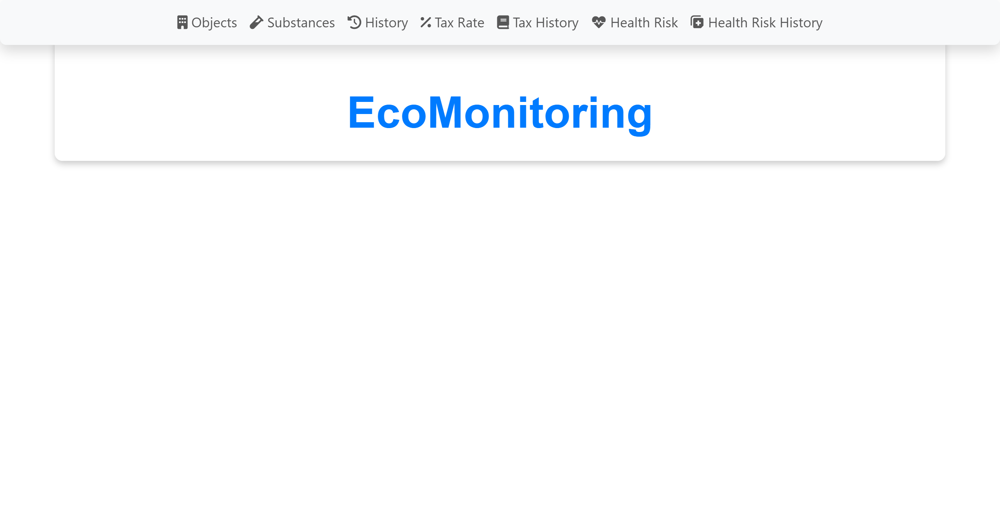
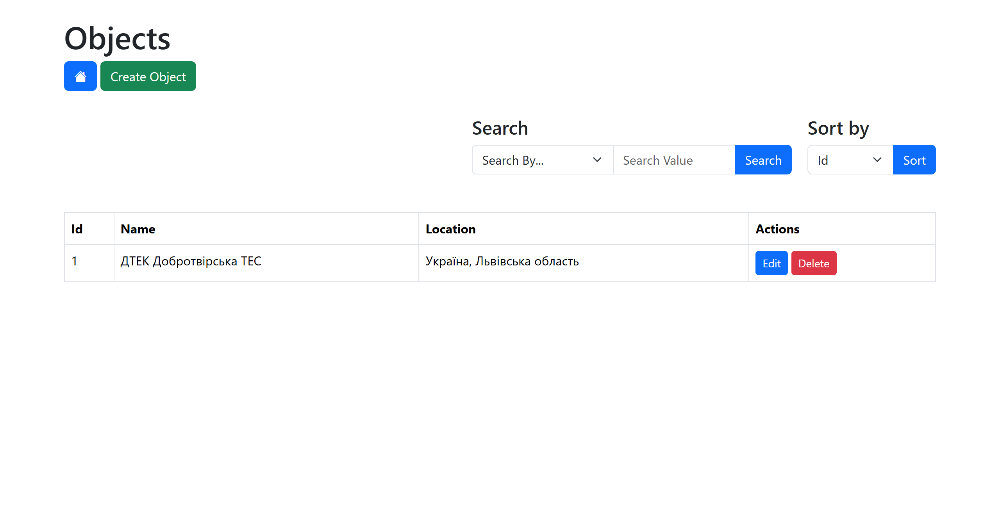
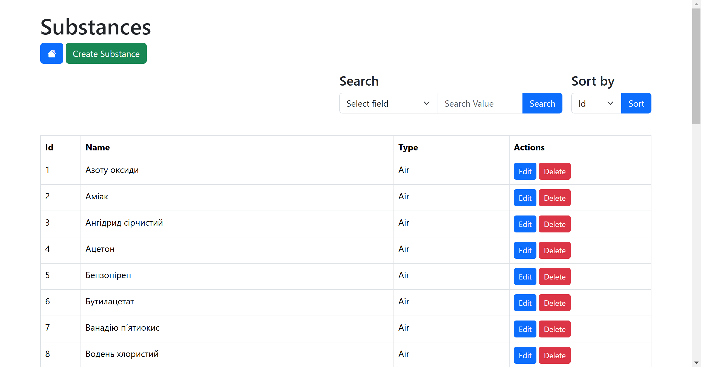
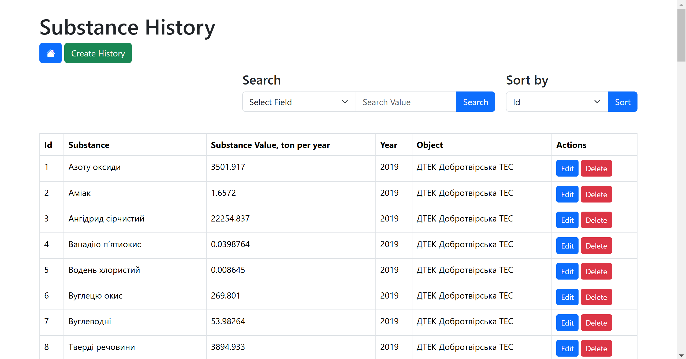
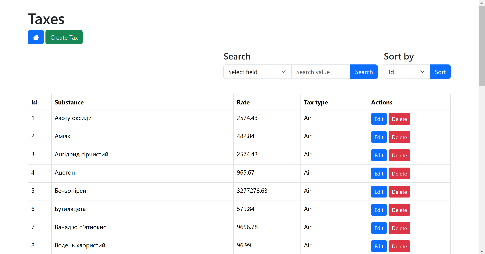
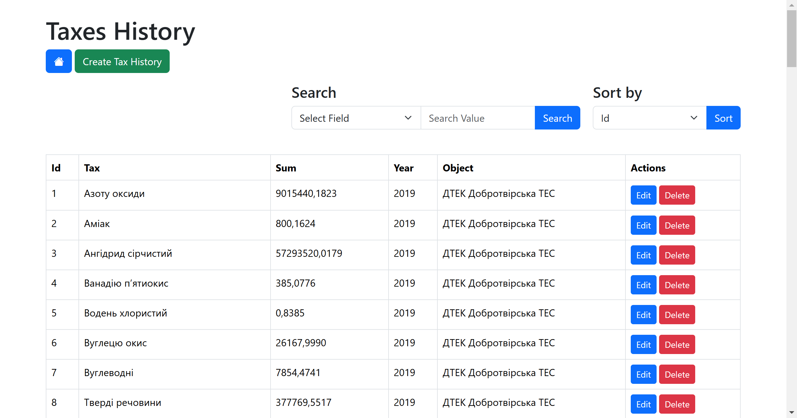
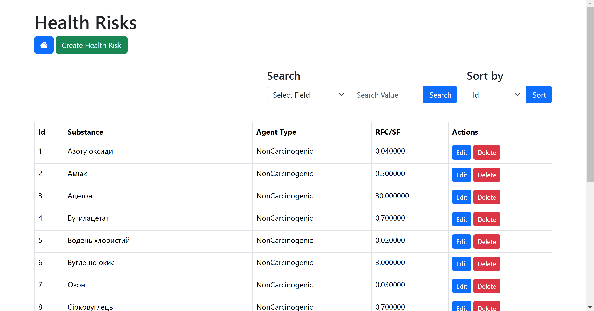
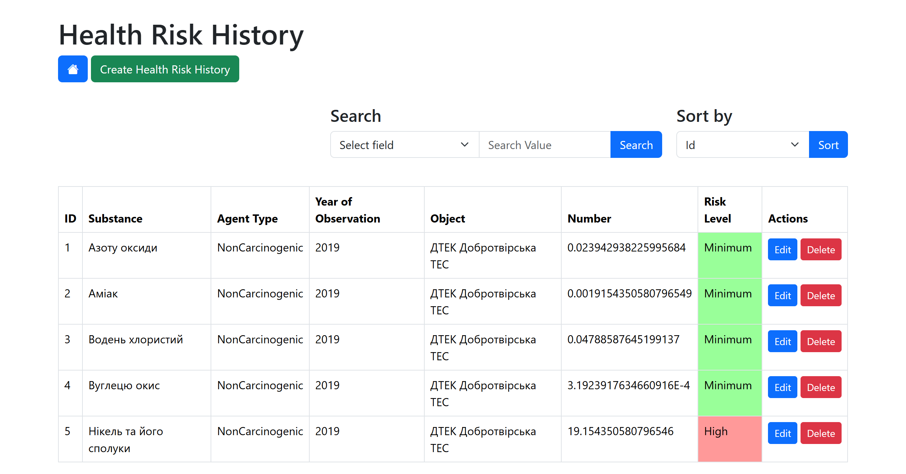

# EcoMonitoring

**EcoMonitoring** is a web application designed to track and manage environmental data, focusing on emissions monitoring and tax calculations for businesses. The application allows users to input and view data on various pollutants, such as air, water, and radioactive emissions, while automatically calculating taxes based on environmental impact.

## Features

- **Emission Tracking**: Monitor and store emission data for different objects and substances.
- **Tax Calculation**: Automatically calculate and track taxes based on emission levels and environmental regulations.
- **Database Integration**: Utilizes PostgreSQL for storing emission histories, tax records, and other related data.
- **User Management**: Manage users and their roles with access control, ensuring secure access to sensitive data.
- **Intuitive UI**: Built with Thymeleaf for server-side rendering, providing a user-friendly interface to display emission and tax data.
- **Backend Logic**: Powered by Java and Spring Boot, with Hibernate and Spring Data JPA for database interaction.
- **Create, Update, Delete Objects**: Users can create, update, and delete any objects tracked in the system, allowing for full CRUD (Create, Read, Update, Delete) functionality on objects.
- **Search & Sort**: The application allows users to search and sort emission data and objects based on different criteria, such as name, emission levels, and date, to quickly find relevant information.

## Pages

1. **Home Page**: The main landing page displaying an overview of the application and key information.  
   

2. **Objects Page**: Displays a list of monitored objects and their related environmental data. Users can create, update, delete, and search for objects.  
   

3. **Substances Page**: Shows detailed information about the substances being tracked, including their emissions and risks.  
   

4. **Substance History Page**: Provides a history of emission data related to different substances over time.  
   

5. **Tax Page**: Displays information about tax rates and calculation methods based on emission levels.  
   

6. **Tax History Page**: Shows a detailed history of tax records calculated for businesses or objects.  
   

7. **Health Risk Page**: Presents information about health risks associated with different substances or emissions.  
   

8. **Health Risk History Page**: Displays the historical data of health risks associated with environmental exposure.  
   

## Technologies Used

- **Java** & **Spring Boot** for backend development and RESTful APIs.
- **Spring Data JPA** & **Hibernate** for database interaction.
- **PostgreSQL** as the primary database for storing environmental data.
- **Thymeleaf** for building dynamic, server-side rendered views.

## Installation

1. Clone the repository:
   ```bash
   git clone https://github.com/yourusername/EcoMonitoring.git
2. Navigate to the project directory:
   ```bash
   cd EcoMonitoring
3. Set up database (PostgreSQL) and configure the application properties.
4. Run the application:
  ```bash
   ./mvnw spring-boot:run
